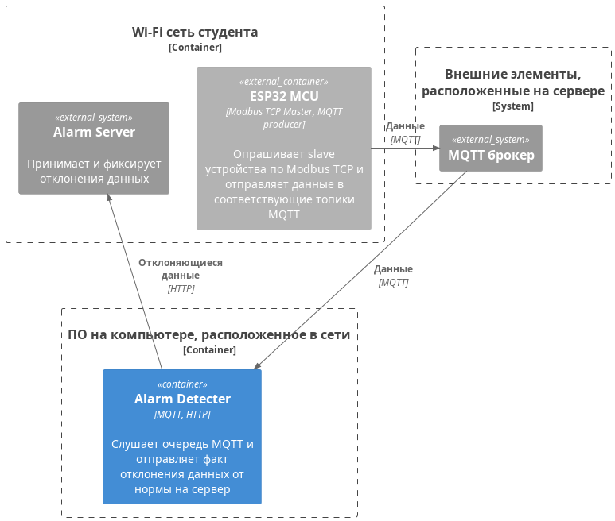

# Цель работы
> Изучить принципы работы MQTT и взаимодействия по HTTP

# Задание

**Схема компонентов**



**Внимание: данная работа является продолжением [работы]({{site.baseurl}}/micropython/labs/lab_10/doc)**

Необходимо реализовать скрипт на языке Python, который будет реализовывать следующий функционал:
* слушатель MQTT подписан на топики с Вашими данными от ESP32 (которые отправляются в результате [работы]({{site.baseurl}}/micropython/labs/lab_10/doc))
* реализует определение данных, которые отклоняются от нормы (LL, HH)
* реализует идентификацию устройства
> Фактически ваша задача определить, где в топиках MQTT будут именно Ваши данные, а это проще всего выполнять по mac-адресу в топике.
> 
> Например, топик можно обозначить:
> 
> ```DATA/00:1A:2B:3C:4D:5E```
> 
> В этом случае будет упорядоченность данных и единообразие структуры топиков/
* реализует отправку данных на Alarm Server в определенном формате, указанном в swagger, в случае успеха, получает ответное сообщение

**Весь функционал должен быть реализован в едином скрипте**

Определение отклонений:

|       | Датчик      |  LL   |   HH   | Ед.изм. |
| :---: | ----------- | :---: | :----: | :-----: |
|   1   | температуры | t<100 | t>300  |    С    |
|   2   | давления    | p<50  | p>150  |   кПа   |
|   3   | расхода     | f<600 | f>1500 |   л/с   |


**Внимание спецификацию можно получить по ip-адрес:3959/docs/**


# Отчет
В отчете представить скриншоты и описание действий по пунктам, представленным в задании.
Отчет по ГОСТу

# Защита
* HTTP (типы запросов, структура запроса, какие запросы для чего применяются, клиент-серверная архитектура, другие протоколы, использующиеся в клиент-серверной архитектуре, применение)
* MQTT (построение сети, архитектура, типы сообщений, применение)
* какие аппаратные элементы необходимы для реализации взаимодействия