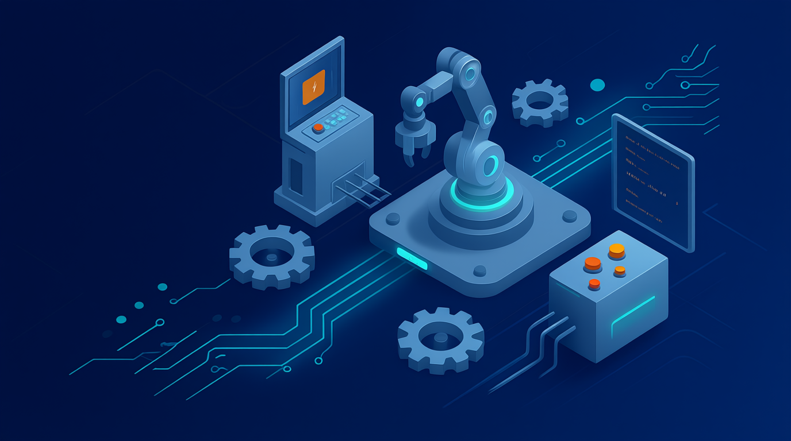

## Описание
Данный репозиторий создается с целью объединить большое количество разнородных источников информации в едином месте, удобном для изучения студентом.

Репозиторий состоит из:
* теоретической информации, сформированной и представленной в источниках
* заданий для лабораторных и практических работ
* заданий для комплексных работ для декомпозиции задачи на подгруппы студентов (студенты трудятся над блоками задач, в результате при правильно реализованной и скоординированной работе решается основная задача)

Для выполнения работ основным подходом является P2P (peer to peer) подход, при котором студенты коммуницируют друг с другом при решении задач, находят нестандартные решения, пользуются любыми источниками, включая искусственный интеллект. Преподаватель в данном подходе выступает в роли **архитектора системы**, и понимает как должна работать система, но не участвует в решении самих задач.

### *[Оставить обратную связь](https://docs.google.com/forms/d/e/1FAIpQLSejGpUBsRG2IhDSR_YFywBlTKLf0yySyrUPkUJhtnGXuG0cqg/viewform?usp=dialog)*