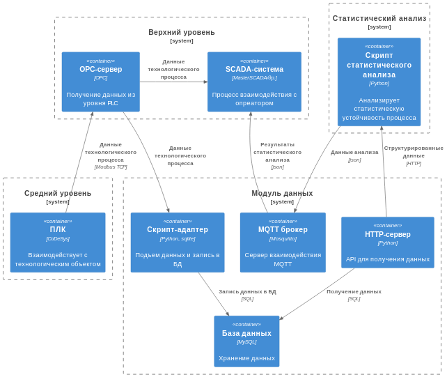

# Цель работы
> 

# Задание
Необходимо реализовать информационную систему, состоящую из нескольких модулей.
В общих чертах:
* ПЛК получает данные процесса, отдает на верхний уровень
* Верхний уровень визуализация, подъем данных
* Данные необходимо хранить в БД, а для доступа к ним адаптер в виде HTTP gateway
* Для анализа стабильности используем "статистический анализ"

## Средний уровень
20 % группы

* Взаимодействие с данными на нижнем уровне, получение данных с датчиков.
* Реализация ПО для взаимодействия с датчиками
* Реализация ПО для передачи данных на OPC-сервер по Modbus TCP

В качестве ПЛК использовать ОВЕН.
Программное обеспечение CoDeSys 2.3.

## Верхний уровень
30 % группы

### OPC-сервер
* Подъем данных с нижнего уровня (Modbus TCP)
* Реализация интерфейса для SCADA-системы и приложений

### SCADA-система
* Получение данных с OPC-сервера
* Визуализация параметров в реальном времени
* Визуализация данных о статистическом анализа
* Реализация защит по статистическому анализу

OPC использовать MasterOPC Server.
SCADA система MasterSCADA.

## Модуль данных
30% группы

### Скрипт-адаптер
* Получение данных из OPC-сервера
* Отправка данных в БД

### HTTP-сервер
* Получение данных из БД
* Реализация API для получения n-последних данных с БД

### MQTT-брокер (готовое решение Mosquito)
* Реализует взаимодействие MQTT

### База данных (готовое решение СУБД MySQL)
* Взаимодействие с данными

Скрипт адаптер реализовать на языке Python.
HTTP-сервер на языке Python, фреймворк FastAPI.
Брокер и БД будут развернуты на одном из серверов.

## Статистический анализ
20% группы

* Получение данных с HTTP-сервера
* Анализ на статистическую устойчивость Хотеллинга, Шухарта

Реализация скрипта на Python.

# Отчет
* Общее описание системы и модулей.
* Подробное описание разрабатываемого модуля.
* Программный код, структура проекта, описание использованных технологий.
Отчет по ГОСТу.

# Защита
* вопросы по PLC, SCADA
* вопросы по HTTP, API, СУБД
* вопросы по статистике
* вопросы по телекоммуникациям
