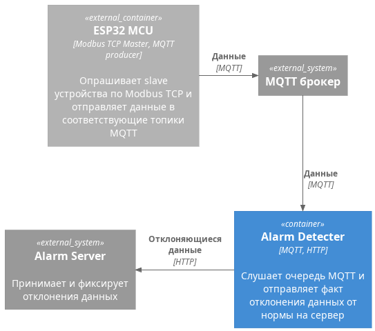

# Цель работы
> Изучить принципы работы MQTT и взаимодействия по HTTP

# Задание

**Схема компонентов**

Необходимо реализовать скрипт, который будет реализовывать следующий функционал:
* слушатель MQTT подписан на топики с Вашими данными от ESP32
* реализует определение данных, которые отклоняются от нормы (LL, L, H, HH)
* реализует идентификацию устройства
* реализует отправку данных на Alarm Server в определенном формате, указанном в swagger, в случае успеха, получает ответное сообщение

**Внимание спецификацию можно получить по ip-адрес:3959/docs/**

# Отчет
В отчете представить скриншоты и описание действий по пунктам, представленным в задании.
Отчет по ГОСТу.

# Защита
