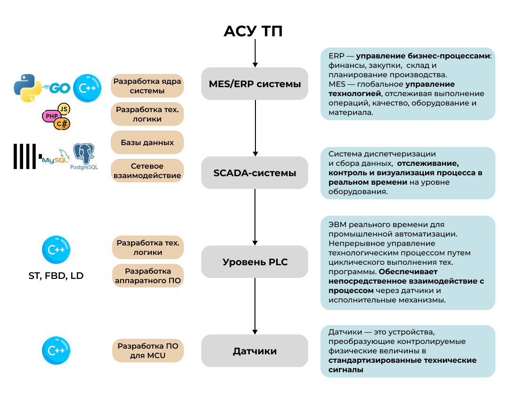

Современные направления автоматизации технологических процессов невозможны без технологий в области разработки ПО, цифровизации, встраиваемых систем. В основе направлений - тесная связь между аппаратным и программным обеспечением, где обязательно определение наиболее производительных, передовых технологий в сочетании с сохранением абсолютной надежности.

