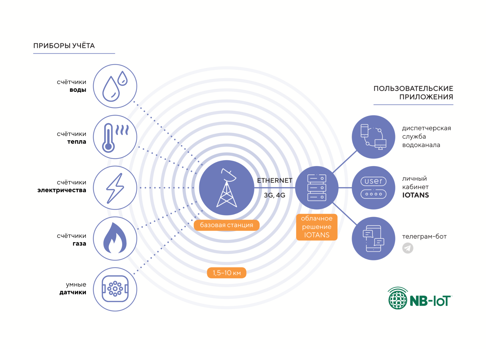
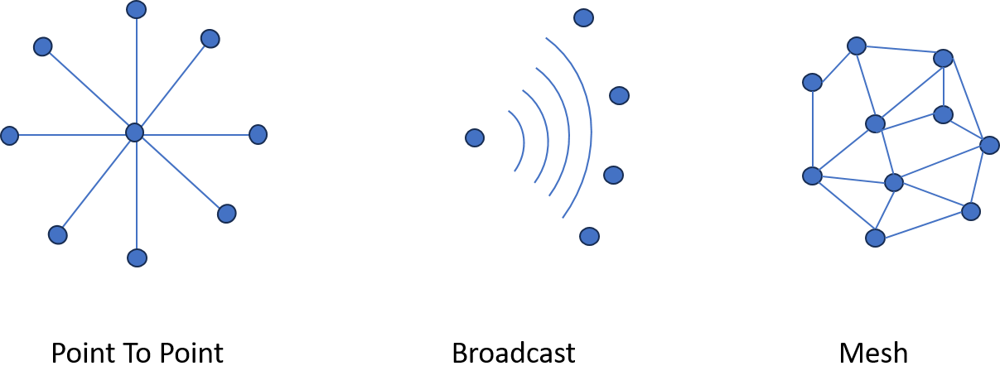
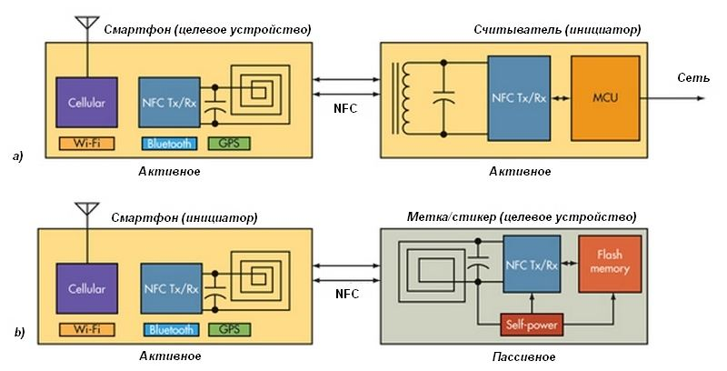

# Принципы организации M2M-коммуникаций
Межмашинное взаимодействие (M2M – machine to machine) относится к процессу
связи физического объекта или устройства на машине с другими того же типа, в основном
для мониторинга, но также и для целей управления.

По способам передачи данных M2M-коммуникации бывают:
* **проводные**
* **беспроводные**

При передаче данных одни и те же протоколы (которые имеют такую возможность) могут быть применимы как при проводной реализации, так и беспроводной.

Требования к системе:
* **масштабируемость** (система должна иметь возможность обработать информационный обмен между новыми устройствами)
* **информационная безопасность** (данными должны быть идентифицируемы только коммуницируемыми устройствами)
* **логируемость** (должны быть реализованы логи данных, в том случае при ошибочных ситуациях для последующей обработки)

Отличия между М2М и IOT:

|     Параметр     |                                     М2М                                      |                                                    IOT                                                     |
| :--------------: | :--------------------------------------------------------------------------: | :--------------------------------------------------------------------------------------------------------: |
|  Предназначение  |                   Прямое взаимодействие между устройствами                   | Глобальная сеть связанных устройств, объединенных в облачную платформу для сбора, анализа и обмена данными |
| Масштабируемость | Ограниченная масштабируемость, часто ориентированная на отдельные соединения |                      Высокая масштабируемость за счет подключения множества устройств                      |
|       Цель       |                    Автоматизация процессов и коммуникаций                    |                  Анализ данных, оптимизация и сетевое взаимодействие в больших масштабах                   |

Применение M2M:
* **интернет вещей** (IOT): системы управления уличным освещением, мониторинга ЖКХ, управления парковками, камеры наблюдения и общественная безопасность
* **логистика**: GPS-мониторинг, управление автопарком, отслеживание грузов, телематика, системы «умного» транспорта, автосигнализации, GPS
* **здоровье**: удаленный мониторинг состояния пациентов, телемедицина, управление медицинским и лабораторным оборудованием
* **платежные системы**: банкоматы, POS-терминалы
* **АСУ ТП**: автоматизация, мониторинг оборудования, управление производственными процессами, контроль качества

***

# Архитектура M2M

Основные компоненты М2М-коммуникации:
* **источник данных** - устройство, которое может передать полезную информацию
* **среда передачи данных** (включает интерфейсы и протоколы)
* **потребитель данных** - устройство, которое может получить данные и обработать

В общем смысле можно определить, что система должна состоять из устройств, которые имеют информацию, готовые ее передавать, или получать. Также из системы передачи данных, состоящую из физического уровня и прикладного, для реализации среды передачи данных между устройствами.
Для M2M-коммуникаций достаточно этих условий.

Общая реализованная сеть коммуникаций может быть реализована через интернет, либо локальную физическую среду. Также для получения данных могут быть реализованы интерфейсы в виде API/SDK/приложений.

Для доступа сети M2M к сети интернет, в случае если используется локальная сеть M2M, будет применяться шлюз (gateway), который позволяет скоординировать общение между локальной и глобальной сетями.

***

# Современные технологии в информационном обмене
## ZigBee

Zigbee - стандарт беспроводной связи для умных устройств.
Центральным узлом в сети Zigbee является **координатор**. Он создает сеть, выбирает, на каком канале общаться, может выступать как «центр доверия». 

**Роутеры** — устройства уже чуть попроще. Они служат зачастую ретрансляторами сообщений от конечных устройств. 

**Конечные устройства** — то, что мы объединяем в сеть, то есть выключатели, лампочки, датчики движения и прочие гаджеты.

Главное преимущество Zigbee - его низкое энергопотребление, благодаря чему устроства могут продолжительное время работать от источников питания. Достигается это в том числе за счет того, что период активности (отправки сообщений) крайне мал, основное время устройства простаивают в энергоэффективном режиме.

Zigbee не предназначен для передачи большого количества данных, и используется в системах IoT для передачи показаний сенсоров, для чего и подходит максимально хорошо.

Пример реализации:

## LoRaWAN

LoRa (Long Range) - это фактически вид модуляции сигнала, который используется при передачи данных в сети LoRaWAN.

Архитектура сети включает следующие компоненты:
* **конечные устройства** - датчики интернета вещей, которые собирают данные, либо могут быть исполнительными механизмами
* **шлюзы (базовые станции)** - принимают сигнал уровня LoRa и транслируют на сервер
* **сервер** - управляет сетью, обрабатывает данные, реализует авторизацию, аутентификацию, обеспечивает безопасность передачи данных (в наименьшем функционале обеспечивает передачу данных между сетью LoRa и интерфейсами, в наибольшем - имеет дополнительные возможности, в зависимости от реализованного функционала)
* **приложение** - реализация сервиса, подключенного к интерфейсу сервера, для дальнейшей обработки/управления/визуализации

Особенности:
* дальность связи (5-10 км в городской и открытой местности)
* низкое энергопотребление
* масштабируемость
* безопасность на всех уровнях
* открытость стандарта (для возможности реализации кастомных устройств и прошивок)

Пример реализации:

## NB-Iot

NB-IoT – это технология маломощных широкополосных сетей (LPWAN), предназначенная для обеспечения связи с большим количеством маломощных устройств IoT на больших расстояниях. Она работает в лицензированном спектре и использует узкую полосу пропускания 200 кГц или менее для передачи данных. Такая узкая полоса пропускания позволяет ей работать в среде с высоким уровнем помех и шумов, что делает его идеальным выбором для промышленных IoT-решений.

NB-IoT использует узкополосную частоту 200 кГц для передачи данных на большие расстояния. В нем используются две технологии модуляции – OFDM (мультиплексирование с ортогональным частотным разделением) для downlink (нисходящей) связи и SC-FDMA (множественный доступ с частотным разделением с одной несущей) для uplink (восходящей) связи. Это делает его идеальным выбором для устройств IoT, которым требуется низкая скорость передачи данных, длительное время автономной работы и расширенное покрытие.

Особенности:
* крайне низкое энергопотребление
* большое покрытие
* устойчивость сигнала при использовании внутри зданий
* необходимость использования СИМ-карт / устройств от операторов связи

## Bluetooth + BT

BT classic:
* используется для потоковых приложений, таких как трансляция аудио- и видео-контента и непрерывная передача данных
* не оптимизирован для низкого энергопотребления, но поддерживает большую скорость передачи (максимум 3 МБит/с)
* быстрые прыжки по 79 каналам (frequency hopping) до 1600 раз в секунду
* обнаружение происходит на 32 каналах

BLE:
* используется в сенсорах и для управления устройствами и приложениями, не требующими передачи больших объемов данных (максимум 2 МБит/с)
* предназначен для применения в малопотребляющих устройствах с большими интервалами между передачей данных
* использует 40 радиоканалов
* обнаружение происходит на 3 каналах, что приводит к более быстрому обнаружению и установке соединения

## NFC

NFC расшифровывается как «Near Field Communication» («Коммуникация ближнего поля») и, как следует из названия, обеспечивает связь на коротком расстоянии между совместимыми устройствами. Для этого требуется как минимум одно устройство для передачи, а другое — для приема сигнала. Ряд устройств используют стандарт NFC и будет считаться пассивным или активным.

Пассивные устройства NFC включают в себя метки и другие небольшие передатчики, которые отправляют информацию на другие устройства NFC без необходимости использования собственного источника питания. Однако они не обрабатывают любую информацию, отправленную из других источников, и не подключаются к другим пассивным устройствам. Они часто используются для интерактивных знаков на стенах или, например, рекламных объявлений.

Активные устройства умеют отправлять или получать данные и обмениваться данными друг с другом, а также с пассивными устройствами. На данный момент именно смартфоны являются наиболее распространенной формой активного устройства NFC. Считыватели карт общественного транспорта и сенсорные платежные терминалы также являются хорошими примерами этой технологии.

## MQTT, AMQP

В отличие от стандартов описанных ранее, MQTT и AMQP в качестве более низкого уровня используют более общепринятый и глобальный стандарт (интернет)

***

**Источники, использованные при подготовке материала**

[Источник](https://farabi.university/storage/files/365899673667175e2938604348907000_%D0%9B%D0%B5%D0%BA%D1%86%D0%B8%D1%8F_5%20M2M-%D0%BA%D0%BE%D0%BC%D0%BC%D1%83%D0%BD%D0%B8%D0%BA%D0%B0%D1%86%D0%B8%D1%8F%20%D0%B2%20IoT+.pdf), [Источник](https://reolink.com/blog/what-is-m2m/), [Источник](https://www.a1.digital/knowledge-hub/what-is-m2m-communication/), [Источник](https://xakep.ru/2019/09/30/zigbee-exploits/), [Источник](https://ivan.bessarabov.ru/blog/what-is-zigbee), [Источник](https://lar.tech/blog/chto-takoe-lorawan/), [Источник](https://www.mdpi.com/1424-8220/19/1/215/xml), [Источник](https://gelecekbt.com/RS485-to-LORA-Converter-CLR-LORA-C485D), [Источник](https://iotans.by/texnologii/chto-takoe-nb-iot),
[Источник](https://nekta.tech/obzor-nb-iot-i-primenenie-v-iot/), [Источник](https://habr.com/ru/companies/dsec/articles/685514), [Источник](https://habr.com/ru/articles/479904)