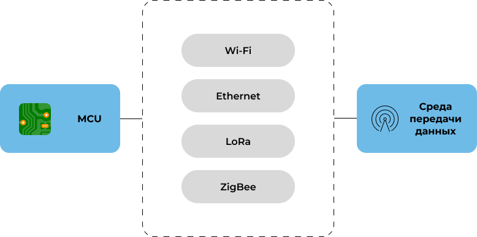
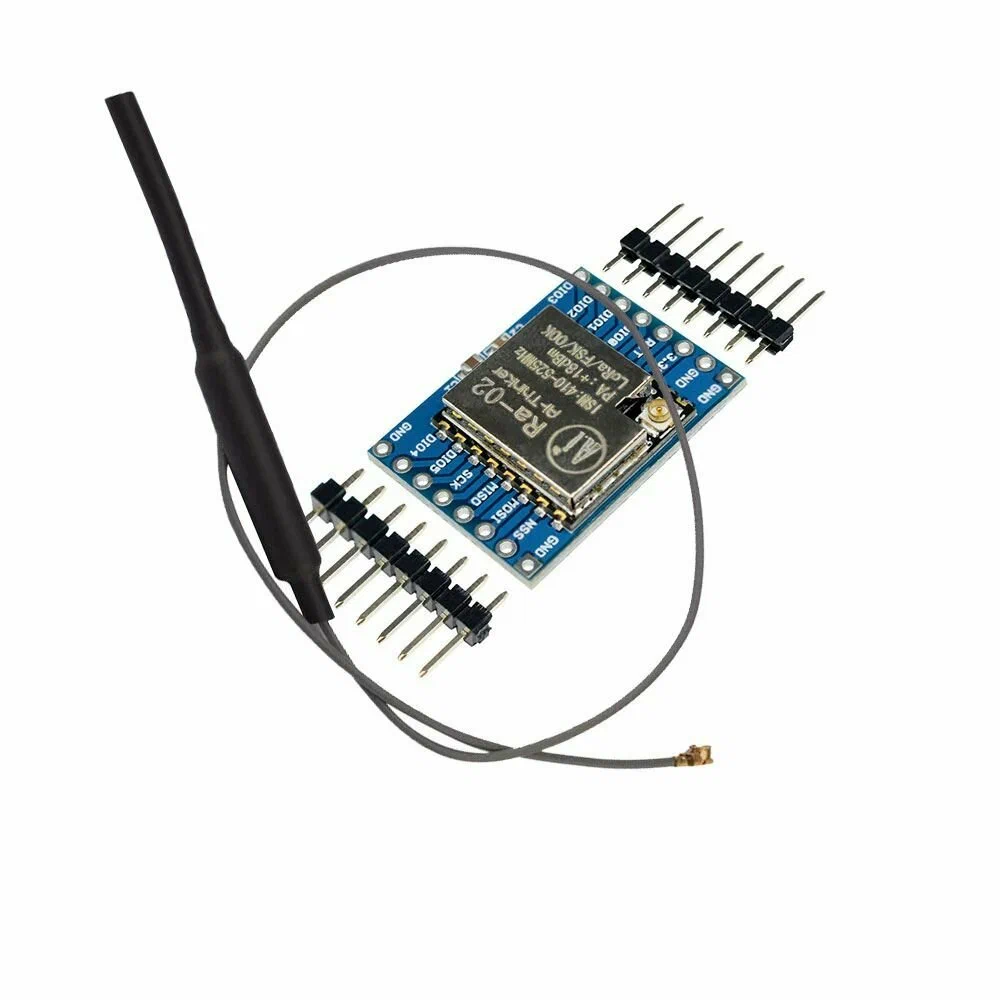

# Интеграция устройств с протоколами M2M
## Физический уровень

По способу взаимодействия m2m коммуникации делятся на:
- использующие TCP стек
  - Ethernet
  - Wi-Fi
  - Сотовые сети (LTE, LTE-M, NB-IoT)
- задействующие сторонние протоколы
  - ZigBee
  - Z-Wave
  - Bluetooth Low Energy (BLE)
  - LoRa / LoRaWAN

Рассмотрим подключение MCU для использования m2m коммуникаций.

Для подключения к m2m обязательно наличие компонента, который позволит подключаться к сети.
В том случае, если технология использует сеть tcp, то это может быть подключение по Wi-Fi / Ethernet через адаптеры.

Для других технологий используются собственные модули.

Модуль Ethernet:

Модуль LoRa:

## Прикладной уровень

# Источники
* [Источник]()
