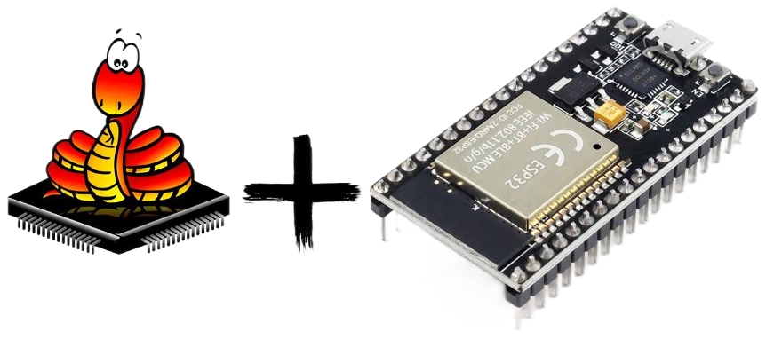

# Краткое описание направления
Материал направлен на:
* изучение микроконтроллеров и работу с MCU ESP32
* изучение языка программирования MicroPython
* изучение сетевых протоколов и технологий с использованием ESP32 + MicroPython

# [Теоретический материал]({{site.baseurl}}/micropython/theory/)

# [Лабораторные работы]({{site.baseurl}}/micropython/labs/)