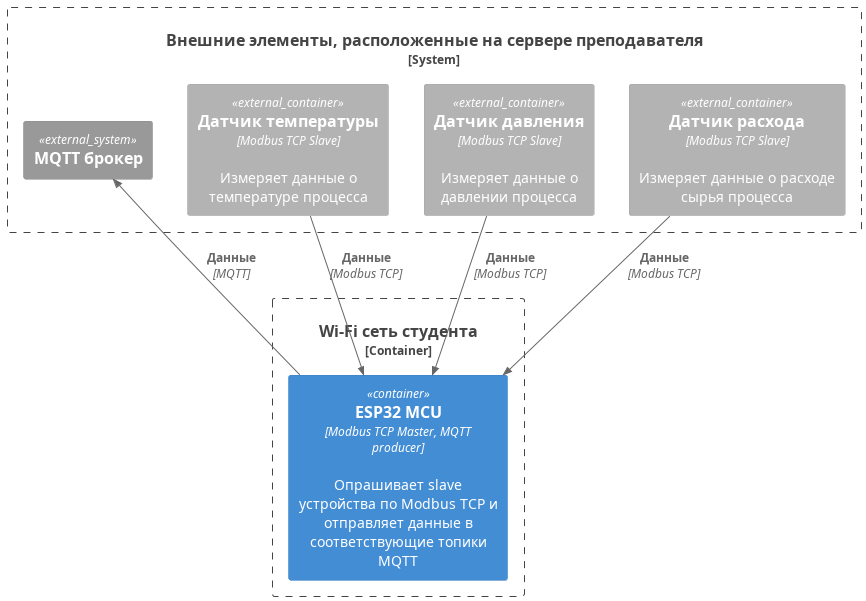

# Цель работы
> Ознакомиться с принципом работы протокола Modbus TCP и MQTT

# Теоретические сведения

# Задание
**Схема компонентов**

Необходимо реализовать на ESP32 на языке MicroPython:
* реализовать подключение к сети Wi-Fi, которое Вы раздаете с телефона (должен быть интернет)
* реализовать опрос 3-х slave-устройств по Modbus TCP, которые являются датчиками
* реализовать отправку данные по MQTT
* учесть, что данные имеют разные источники и должны быть отделены в MQTT (в MQTT должно быть понятно что это за измерение)
* учесть, что необходимо указать источник отправителя данных (в MQTT должно быть понятно кто отправил данные)

<!-- 40 - 360 -->
<!-- 100 - 300 -->

<!-- 20 - 180 -->
<!-- 50 - 150 -->

<!-- 200 - 1800 -->
<!-- 600 - 1500 -->

Параметры Modbus RTU slave:

|       | Датчик      | ip-адрес | Порт  | Регистр | Кол-во регистров |  LL   |   HH   | Ед.изм. |
| :---: | ----------- | -------- | :---: | :-----: | :--------------: | :---: | :----: | :-----: |
|   1   | температуры | ip       | 5021  |    0    |        1         | t<100 | t>300  |    С    |
|   2   | давления    | ip       | 5022  |    0    |        1         | p<50  | p>150  |   кПа   |
|   3   | расхода     | ip       | 5023  |    0    |        1         | f<600 | f>1500 |   л/с   |

**Учесть:**
* код должен быть уникальным
* код должен иметь комментарии
* данные, полученные в mqtt должны быть идентифицируемы

# Отчет
В отчете представить скриншоты и описание действий по пунктам, представленным в задании
Отчет по ГОСТу

# Защита
* Modbus TCP/RTU, структура пакета, структура сети, команды, реализация в АСУ ТП, применение, аппаратная часть для реализации
* TCP/IP
