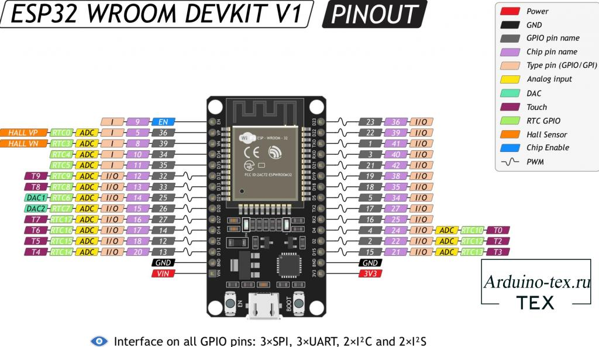

# Лабораторная работа №1 "Реализация ППО для МК на языке MicroPython"

## Цель работы
> Ознакомиться с основами разработки прикладного программного 
> обеспечения для микроконтроллеров на языке MicroPython

## Теоретические сведения
* [Инструкция по прошивке ESP32](../../docs/firmware.md)
* [Пример кода](../../examples/example_1.py)

MicroPython — это легковесная реализация Python 3, предназначенная для 
встроенных систем с ограниченными ресурсами. 
Он позволяет разработчикам использовать знакомые концепции 
и библиотеки Python для ускорения разработки приложений 
для микроконтроллеров.

ESP32 — это мощный микроконтроллер с поддержкой Wi-Fi и Bluetooth, 
широко используемый в разработке IoT-устройств. 
ESP32 поддерживает развертывание программ на MicroPython, 
что делает его удобным в учебных и прототипирующих целях.

**Распиновка ESP32**\


**Модуль machine:**
```python
import machine

machine.freq()          # прочесть текущую частоту CPU
machine.freq(240000000) # задать частоту CPU на 240 МГц
```
**Модуль esp:**
```python
esp.osdebug(None)       # выключить отладочные сообщения ОС
esp.osdebug(0)          # перенаправить отладочные сообщения ОС
                        # на порт UART0

# низкоуровневые методы для взаимодействия с flash-памятью:
esp.flash_size()
esp.flash_user_start()
esp.flash_erase(sector_no)
esp.flash_write(byte_offset, buffer)
esp.flash_read(byte_offset, buffer)
```
**Модуль esp32:**
```python
import esp32

esp32.hall_sensor()     # прочесть данные встроенного датчика Холла
esp32.raw_temperature() # прочесть внутреннюю температуру MCU
                        # (в Фаренгейтах)
esp32.ULP()             # получить доступ к ULP-сопроцессору
                        # (от англ. «ultra-low power», что значит
                        # «ультранизкое энергопотребление»)
```
**Контакты и GPIO**
```python
from machine import Pin

p0 = Pin(0, Pin.OUT)    # создать выходной контакт на GPIO0
p0.on()                 # задать контакту значение «вкл» 
p0.off()                # задать контакту значение «выкл»
p0.value(1)             # задать контакту значение «вкл» («1»)

p2 = Pin(2, Pin.IN)     # создать входной контакт на GPIO2
print(p2.value())       # прочесть значение («0» или «1»)

p4 = Pin(4, Pin.IN, Pin.PULL_UP) # включить встроенный
                                 # подтягивающий резистор
p5 = Pin(5, Pin.OUT, value=1) # создать выходной контакт
                              # со значением «вкл» («1»)
```

## Задание
1) Управление встроенным светодиодом
    * собрать схему
    * написать код программы (включение светодиода на 1 секунду, выключение светодиода на 1 секунду)
2) Реализовать вывод значений внутренней температуры на экран (В Фаренгейтах и в Цельсиях)
3) Реализовать вывод данных со встроенного датчика Холла 
(провести эксперимент с поднесением к ESP32 диэлектрика, магнита)

## Отчет
В отчете представить скриншоты и описание действий по пунктам, представленным в задании

## Защита
- [Источник](https://habr.com/ru/articles/445936/)
- что такое MicroPython, как устроено, как работает?
- применение микроконтроллеров в АТПП