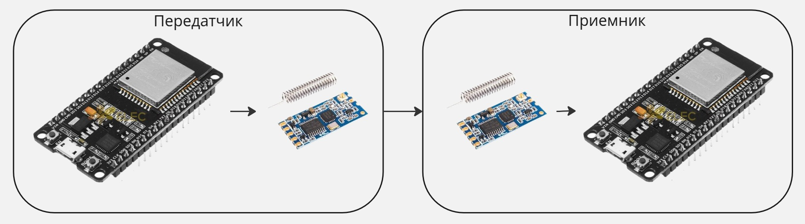

# Лабораторная работа №2 "Работа с радиопередатчиком по UART"

## Цель работы
> Ознакомиться с основами работы с UART и передачей информации по 433 МГц

## Теоретические сведения
* [Инструкция по прошивке ESP32](../../docs/firmware.md)
* [Пример кода](../../examples/example_2.py)

### UART
```python
from machine import UART

uart1 = UART(1, baudrate=9600, tx=33, rx=32)
uart1.write('hello')  # write 5 bytes
uart1.read(5)         # read up to 5 bytes
```

The ESP32 has three hardware UARTs: UART0, UART1 and UART2. They each have default GPIO assigned to them, 
however depending on your ESP32 variant and board, these pins may conflict with embedded flash, 
onboard PSRAM or peripherals.

Any GPIO can be used for hardware UARTs using the GPIO matrix, except for input-only pins 34-39 that can be used as rx. 
To avoid conflicts simply provide tx and rx pins when constructing. The default pins listed below.

## Задание
Связь по радиоканалу


1) Собрать схему
2) Указать номера пинов микроконтроллера, которые соединены с Tx/Rx передатчика.
3) Реализовать код для отправки сообщения
4) Другому варианту реализовать код для непрерывной прослушки сообщений и вывода на экран
5) Объединиться с другим вариантом и организовать прием-передачу данных по радиоканалу

## Отчет
В отчете представить скриншоты и описание действий по пунктам, представленным в задании

## Защита
* https://www.ru-ebyte.com/news/514
* https://radiocom.su/information/artikles/?433-868mhz