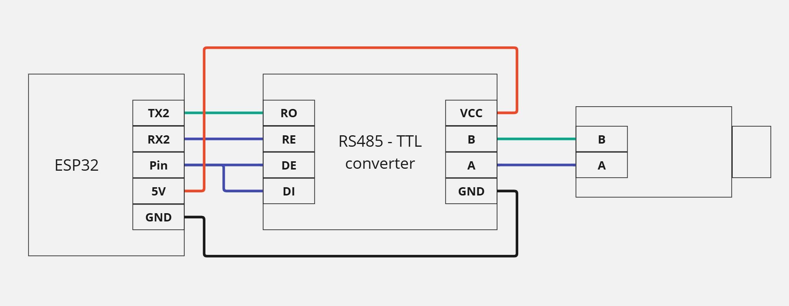

# Цель работы
> Ознакомиться с реализацией сети Modbus RTU при помощи ESP32 на языке программирования MicroPython

# Теоретические сведения
* [Инструкция по прошивке ESP32](../../docs/firmware.md)
* [Пример кода](../../examples/example_7.md)

Схема подключения:

# Задание
1. Реализовать Modbus Slave устройство на ESP32 при помощи библиотеки
2. Объявить регистр по определенному адресу и передавать в цикле данные внутренней температуры в этот регистр
3. На ПК установить ПО Modbus OPC Server и настроить его
4. И реализовать Modbus Master, который опрашивает ESP32 и получает регистр с данными
5. В результате чего на экране в OPC по указанному регистру должно передаваться значение температуры с ESP32

**Дополнительные указания:**
* файл с библиотекой должен быть также загружен в ESP32
* указать идентичные параметры Modbus RTU в Slave и в Master

# Защита
* [Источник](https://habr.com/ru/companies/advantech/articles/450234/)
* [Источник](https://asutp.ru/publikacii/2021/04/29/prosto-o-standartah-opc-da-i-opc-ua/) (OPC UA, OPC DA)
